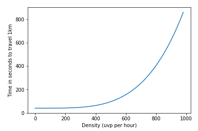

_______
# 
 TRAFIC MODELIZATION REPORT  

_______

## Brief description of the project: 
_The aim of this project is to modelize a road trafic. To do so I used an open dataset:_ https://opendata.lillemetropole.fr/explore/dataset/voies_mel/table/ 

## Table of content:
#### <a href='#section1'>[Data Processing and creation of the environment]</a>
#### <a href='#section2'>[The model]</a>
#### <a href='#section3'>[Modelling of the traffic through time]</a> 
#### <a href='#section4'>[Generating function of agents]</a> 
#### <a href='#section5'>[Making the graph dynamic]</a> 

## Data Processing and creation of the environment
### Data Set
voies_mel.csv is an open dataset giving :
- GPS coordinates of road section in the MEL ('Métropole Lilloise')
- The corresponding type of raod section
- The average number of users per day for every section
 

### Data Processing
The data processing consitsts in creating several Panda DataFrame from the dataset. All of the data processing is in the notebook Data Processing. The final outputs are: 
- __processed_df__ containing for every sections : the GPS coordinates of the starting point and the ending point, a boolean which states if the road is one way or not (used while we create the directed graph), _trafic_ which is the type of road (associated with an index from 0 to 11) and _weight_ which is the weight we will later associate to the corresponding edge on the graph.   To get this wieght, I scrapped the time travel for every section with the google map API.
- __graph_3_processed__ : is quite the same but instead of the GPS coordinates, every node is associated with a unique index.
 

### Creation of a graph modeling the road network
In order to modelize the road traffic, we will use an environment described by a weighted and directed graph (with the python library NetworkX):  
- __The nodes__ : To translate a road network into a graph, the first step consists in associating a single node to each crossroads (junction point between two sections)
- __The edges__ : The edges correspond to the road sections between two intersections. Like a crossroads, a node can have several outgoing edges
- __The graph orientation__ : Given the possibility that a section can be one-way, it is important to use a directed graph. Thus, an edge connecting two nodes may only be traversable in one direction. This is why it was important to associate a boolen to every section during the data processing condisionning the bi-direction of an edge. 
- __The edge weighting__ : Finally, to integrate the travel time of a section into our model, we associate a penalty value (the edge weight) to each edge. This corresponds to the time required to travel the associated section

# The model :
## Modeling of a single agent:
In order to modelize a road trafic, we will start with a non-dynamic system including a single agent. To do so, we will consider that the agent is rationnal and chose the optimal path in this oriented/weighted graph. To determine this optimal graph between two nodes, there is several existing algorithm. The one tried here are __Dijkstra__ and __A*__. Evenetualy we will use __A*__ wich is both very efficient and fast. 
 
 

__Explanation of the Dijkstra and A* algorithms__:
- First to use the A* algorithm we need to define a heuristic. A heuristic is a function that takes in input one node of a graph and returns a positive value. It might be interpreted as the distance between the nodes and a defined reference node of the graph. However the heuristic function _h_ has to follow to criteras: 
    - Be __positive__ and defined for every point
    - _h_ has to be __monotone__ : $\forall {N_{i},N_{j}}, h(N_{i}) \leq w(N_{i},N_{j}) + h(N_{j})  $     Where $N_{i},N_{j}$ are to connected nodes of the graph and $w(N_{i},N_{j})$ is the distance/weight between those points. The heuristic might be interpreted has a strait line distance between any point and the arriving point. Because we chose to use the travel time as a weight for edges of the graph we here will define the heuristic as :  
    $\forall {N_{i} \in G},$  $  h_{N_{final}}(N_{i}) =  $ $\frac{Distance(N_{i},N_{final})}{HighestSpeed}$
    

______
__ Pseudo code of A* :__    
________
We have:
- A graph $G = (N,W)$, with nonnegative edge weights $w(u,v)$  
- A starting node S and an ending node T
- An admissible heuristic h
 
 
_Let d(n) store the best path distance from S to n that we have seen so far. Then we can think of d(n) + h(n) as the estimate of the distance from S to n, then from n to T. Let Q be a queue of nodes, sorted by d(n) + h(n) :_
   
$d(v)$ ← $
 \left\{
    \begin{array}{ll}
        \infty & \mbox{if } v \neq S\\
        0 & \mbox{if } v = S
    \end{array}
\right.
$  
$Q := $ _the set of reachable nodes from V, sorted by_ $d(n) + h(n)$  
__while__ _Q is not empty_ __do__:  
&nbsp;&nbsp;&nbsp;&nbsp;&nbsp;&nbsp; _V ← Q.top() &nbsp;&nbsp;   #the first node of the list Q_  
&nbsp;&nbsp;&nbsp;&nbsp;&nbsp;&nbsp; __for__ _all neighbours u of v_ ___do___ :  
&nbsp;&nbsp;&nbsp;&nbsp;&nbsp;&nbsp;&nbsp;&nbsp;&nbsp;&nbsp;&nbsp;&nbsp; __if__ $d(V) + w(V,u) ≤ d(u)$ __then__:   
&nbsp;&nbsp;&nbsp;&nbsp;&nbsp;&nbsp;&nbsp;&nbsp;&nbsp;&nbsp;&nbsp;&nbsp;&nbsp;&nbsp;&nbsp;&nbsp; $d(u) ← d(V) + w(V, u)$  
&nbsp;&nbsp;&nbsp;&nbsp;&nbsp;&nbsp;&nbsp;&nbsp;&nbsp;&nbsp;&nbsp;&nbsp; __ end if__  
&nbsp;&nbsp;&nbsp;&nbsp;&nbsp;&nbsp; __ end for __  
__ end while __
   

## Modelling of the traffic through time

Next step is to modelize the traffic. To do so, two important steps are needed:
- __Introduction a notion of time__
- __Multiplication of the agents in the graph__
  
Every step, let's consider a there is a batch of drivers willing to go from a node to another one. We compute the shortest path and consider they took this itinerary.
But, since the trafic implies an increase of the traveling time through a section, we will need to create of function which reflects those new agents on the wieghts. 
- __Time/Flow function: The BPR model__: 
Thus, after a group of cars are released in the environment, with an itinarary, and a corresponding timetable, those cars will move into the graph through time; Changing then the number of users on every sections (the flow values are stored in the flow_edges table). _How does the trafic impact the travelling time?_  
$\tau_{v} = L \times m_{v} \times [1+\gamma_{v}*(\frac{X_{v} + e  X_{c}}{\kappa})^{\alpha_{v}} ]$
 where:  
$ \tau_{v} $ is the time necessary to travel through the section
 
$L$ the lenght of the section
 
$m_{v}$ is the travel time per kilometer for a car at the max speed
  
$\gamma_{v}$ increase proportion at the saturation
 
$X_{v}$ car flow
 
$X_{c}$ heavy goods vehicles flow
 
$e$ equivalence coefficient between car and heavy good vehicles
 
$\kappa$ hourly capacity of the road
 
$\alpha_{v}$ traveling time sensitivity to the relativ flow at a saturation state
 
The three necessary parameters in this model are: $V_{s}$ which is more or less equal to 90% of the highest speed on the section and provides the value of $\gamma_{v}$, $\kappa$ and $\alpha_{v}$. Those parameters depend on the type of roads (storred in the DataFrame graph_3) and are stored in a table: dict_para

We penalize the edges (roads) of the itinerary by increasing the weight of the edge.
Next step we compute the shortest path but with the updated network.
Moreover, the impact of the traffic on the roads vanishes in time so every step we decrease by a certain percentage the penalization of the edges wich have been penalized during the last steps.  
Following, the plot of the time necessary to drive one kilometer on a 0-type road ("VOIE METROPOLITAINE") depending on the density (number of users on the road):

   

## Random generating function of (start, end) and the path and time list associated

From now, in order to modelize the road flow, we would like a function randomly generation starting and arruving points and then compute the shortest path (using A* algorithm) and giving the associated times to go from the starting edge to the following edges. The function is :  
__path_generation__ : 
  
- __Input__ : 
   - graph : The graph used. Here the graph is 'Directed' but the function works for any graph inputed
   - nb_path : The number of path we want to generates simultaneously. The default value is 1.
   - t0 : The starting time considered. (Because we want to eventually have a dynamic system, it is important to explicite the moment it is while we generate new graphs. The default value is 0.
   - taille_paquets : The agents are simulated in group. So we can specify a number of users for every group generated 
- __Output__ :
    - P : A DataFrame giving for the nb_path the optimal path chosen
    - T : A DataFrame giving for the nb_path the traveling time for every edges
    - B : A DataFrame giving for the nb_path a boolean array with the current position of the differents agents on their path. This DataFrame will later be used in order to update the Graph weihgts. It is initialised at True for the first edge and False for the rest of the edges of the different paths.
 

 
  

## Making the graph dynamic
### Flow function: modelize the evolution of the graph through time

To modelize a dynamic trafic system, it is needed to create a DataFrame (__flow_edges__) representing the different edges of the graph and the number of users on them at any time. Thus, we can create a function that is able to update the values of this DataFrame through time:   __ecoulement__ :  
- __input__:
    - P : the different paths considered. eg the differents paths of the different agents driving in the network.
    - T : A DataFrame giving for the nb_path the traveling time for every edges
    - B : A DataFrame giving for the nb_path a boolean array with the current position of the differents agents on their path
    - t : the time considered. The system is dynamic so this function is able to update the position the different drivers are supposed to be anytime.
    - taille_paquets : size of the groups of users generated by __path_generation__. The default value is 100
- __output__: 
    - arretes_modifiees : the only output here is a DataFrame giving the different edges which has been modified. (the edges which have a different flow value before and after the update). It is therefor used by the __update_weight__ function in order to update only few of the edges at every step of time and thus reduce the calculation time. Indeed, calculate the flow time function (__coef_penalisation__) for each section and modifying the value of each graph weight (82000 in our dataset) would be extremely time-consuming to calculate.
      

### Weight update function

The last step consists in creating a tool to update the graph (__Directed__) at every time step. To do so we create a function __update_weight__:
- __input__:
    - flow_edges : the DataFrame with the number of users on every edges of the graph
    - graph :  The graph used
    - A : a list of edges to be modifies. Wich has the same format as the output of __ecoulement__, which allows to pipe those two functions. 
   

## Improvement in the options of path generation
We would like to add the possibility to chose a starting and arriving location instead of randomly picking nodes on the graph.   So we devellope the function __start_end_area__  that makes possible to specify a starting point, arriving point and a radius in order to get a list of potential starting and arriving points and the path_generation function has been modified (__path_generation_2__) to allow the possibility to input the output of __start_end_area__ function and then generate those specific paths. 

 
 
 
 
 

# Simulations :

From now, we have a working environment develloped which allows us to modelize the road trafic. 
